# Blockchain-Based Academic & Event Certificate Generation and Verification System

[](https://github.com/Shravanya178/BLOCKCHAIN_MINIPROJECT/actions/workflows/ci.yml)

A secure, tamper-proof backend and blockchain integration system for issuing, personalizing, and publicly verifying college event certificates using **Solidity smart contracts**, **Node.js/Express**, and **PostgreSQL (Neon)**.

---

## 👥 Project Team
- **02 - Shravanya Andhale**
- **06 - Arnav Chaudhary**
- **11 - Karuna Jeswani**
- **12 - Nikhil Kadam**

---

## 🏗️ Architecture & How It Works

```mermaid
flowchart TD
    subgraph Authority Workflow
        A[Admin / Teacher Logs in] --> B[Create Event & Select Template]
        B --> C[Enter Student or Upload CSV]
        C --> D[Backend Renders PDF with QR Code]
        D --> E[Compute SHA-256 Hash of PDF Bytes]
        E --> F[Submit Registration Tx to Smart Contract]
        F --> G[Store PDF & Confirmed Tx Details]
    end

    subgraph Public Verification
        H[Scan QR Code or Enter Cert ID] --> I[GET /api/v1/verify/:id]
        I --> J[Query Smart Contract on Blockchain]
        J --> K[Return VERIFIED / NOT_FOUND / REVOKED]
        L[Upload Certificate PDF File] --> M[POST /api/v1/verify/document]
        M --> N[Compute File Hash & Compare to Blockchain]
        N --> O[Detect Any PDF Tampering / Alteration]
    end
```



### Key Principles:
1. **Canva Template Integration**: Certificate designs are created in Canva and exported as PNG/JPEG. The backend overlays personalized text and the QR code using fractional page coordinates.
2. **Cryptographic Integrity**: The SHA-256 hash is calculated from the *exact finalized PDF file bytes* after rendering.
3. **No Personal Data on Blockchain**: Only the `certificateId`, document `hash (bytes32)`, `issuer`, and `timestamps` are stored on the blockchain. Student identifiers, names, and contact details remain strictly in the secure PostgreSQL database.
4. **Authoritative Blockchain Truth**: A certificate is never marked as verified unless confirmed by the smart contract.

---

## 💻 Tech Stack

- **Backend:** Node.js (v20+) & Express.js
- **Database & ORM:** PostgreSQL (Neon Serverless) & Prisma ORM
- **Smart Contract:** Solidity `0.8.24` (OpenZeppelin AccessControl)
- **Blockchain Framework:** Hardhat & `ethers.js` v6
- **Networks:** Local Hardhat Node (`localhost:8545`) & Ethereum Sepolia Testnet
- **PDF Generation:** PDFKit
- **QR Codes:** `qrcode` (points directly to public verification URL)
- **Authentication:** JWT Access Tokens & Rotating Refresh Tokens, `bcryptjs`
- **Validation:** Zod schemas
- **API Docs:** Interactive Swagger UI at `/api/docs`

---

## 🚀 Setup & Execution Guide (Windows PowerShell)

### 1. Prerequisites
- [Node.js v20+](https://nodejs.org/) installed (`node -v`)
- [Git](https://git-scm.com/) installed
- PostgreSQL connection string (configured in `.env`)

### 2. Clone and Install Dependencies
```powershell
git clone https://github.com/Shravanya178/BLOCKCHAIN_MINIPROJECT.git
cd BLOCKCHAIN_MINIPROJECT/backend
npm install
```

### 3. Environment Configuration
Create `backend/.env` (use `backend/.env.example` as a template):
```powershell
cp .env.example .env
```
Ensure `DATABASE_URL` and `DIRECT_URL` point to your PostgreSQL instance.

### 4. Database Migration & Seeding
```powershell
npx prisma db push
node prisma/seed.js
```
The seed script creates:
- **Default Admin Account:** `admin@college.edu` | `Admin@12345`
- **Default Teacher Account:** `teacher@college.edu` | `Teacher@12345`
- **4 Starter Templates:** Participation, Achievement, Workshop, and Technical
- **Demo College Event:** *HackVenture 2026 - Annual Hackathon*

### 5. Start the Local Blockchain Node
Open **Terminal 1**:
```powershell
cd backend
npm run chain
```
*Leaves a local Ethereum JSON-RPC node running at `http://127.0.0.1:8545`.*

### 6. Deploy the Smart Contract
Open **Terminal 2**:
```powershell
cd backend
npm run deploy:local
```
*Compiles `CertificateRegistry.sol`, deploys it, and saves deployment info to `deployments/localhost.json`.*

### 7. Start the Backend API Server
In **Terminal 2**:
```powershell
npm start
```
- **API Base:** `http://localhost:4000/api/v1`
- **Interactive Swagger Docs:** `http://localhost:4000/api/docs`
- **Health Check:** `http://localhost:4000/health`
- **Readiness Check:** `http://localhost:4000/ready`

---

## 🎨 Frontend Team Integration Guide

The frontend connects to the backend at `http://localhost:4000/api/v1`.

### 1. Authentication
- Send `POST /api/v1/auth/login` with `{ email, password }`.
- Store `accessToken` and pass it in the `Authorization: Bearer <token>` header for protected endpoints.
- When expired, call `POST /api/v1/auth/refresh` with `{ refreshToken }`.

### 2. Canva Template Workflow
1. Design your certificate in Canva with placeholders for student name, event date, QR code, etc.
2. Export the template from Canva as a high-resolution PNG or JPEG.
3. Upload the background using `PATCH /api/v1/templates/:templateId` (`multipart/form-data` with field `background`).
4. Customize dynamic text positions in `layout` using fractional coordinates `(0.0 to 1.0)`:
   - `x`, `y`: Top-left offset as fraction of page width & height
   - `width`: Width of the bounding box
   - `fontSize`: Base font size in points (auto-shrinks if name is long)
5. Call `GET /api/v1/templates/:templateId/preview` to view and download a live sample PDF.

### 3. Issuing Single Certificate
`POST /api/v1/certificates` (JSON):
```json
{
  "eventId": "UUID_OF_EVENT",
  "templateId": "UUID_OF_TEMPLATE",
  "studentName": "Shravanya Andhale",
  "studentId": "2023CS0101",
  "achievement": "First Prize",
  "certificateTitle": "Certificate of Excellence"
}
```
**Response includes:**
- `certificateId`: e.g., `CERT-2026-X8K9M3P2`
- `status`: `CONFIRMED`
- `documentHash`: `0x...` (SHA-256 of the generated PDF)
- `txHash`: Transaction hash recorded on blockchain
- `blockNumber`: Block number of transaction
- `verificationUrl`: Stable public URL for QR scanning

### 4. Bulk Issuance via CSV Upload
`POST /api/v1/certificates/bulk` (`multipart/form-data`):
- `eventId`: UUID
- `templateId`: UUID
- `file`: CSV file

**Supported CSV Format:**
```csv
student_name,student_id,achievement
"Arnav Chaudhary","CS-2023-001","Special Mention"
"Shravanya Andhale","CS-2023-002","First Prize"
"Karuna Jeswani","CS-2023-003","Runner Up"
"Nikhil Kadam","CS-2023-004","Finalist"
```
Returns row-level statuses and batch details.

### 5. Public Verification (No Login Required)
- **By ID:** `GET /api/v1/verify/:certificateId`
  - Queries blockchain directly in real-time.
  - Returns `VERIFIED`, `REVOKED`, or `NOT_FOUND`.
- **By Uploaded PDF:** `POST /api/v1/verify/document`
  - Upload PDF file under `file`.
  - Calculates SHA-256 and compares to blockchain registry.
  - Returns `HASH_MISMATCH` if any single character or image was modified!

---

## 🧪 Testing

### Smart Contract Unit Tests
```powershell
npm run test:contracts
```
Runs 13 tests covering registration, role-based access, duplicate prevention, custom errors, lookups, and revocations.

### End-to-End API Integration Tests
```powershell
npm run test:api
```
Tests complete flows: Auth -> Events -> Single Issuance -> PDF Tamper Detection -> Bulk 10 Recipients -> Revocation.

---

## 🌐 Deploying to Ethereum Sepolia Testnet

1. Obtain a Sepolia RPC URL (Infura/Alchemy) and a funded private key.
2. In `backend/.env`:
   ```env
   SEPOLIA_RPC_URL=https://sepolia.infura.io/v3/YOUR_INFURA_KEY
   DEPLOYER_PRIVATE_KEY=0xYOUR_SEPOLIA_PRIVATE_KEY
   BLOCKCHAIN_NETWORK=sepolia
   BLOCKCHAIN_RPC_URL=https://sepolia.infura.io/v3/YOUR_INFURA_KEY
   CHAIN_ID=11155111
   BLOCKCHAIN_PRIVATE_KEY=0xYOUR_SEPOLIA_PRIVATE_KEY
   ```
3. Deploy:
   ```powershell
   npm run deploy:sepolia
   ```
